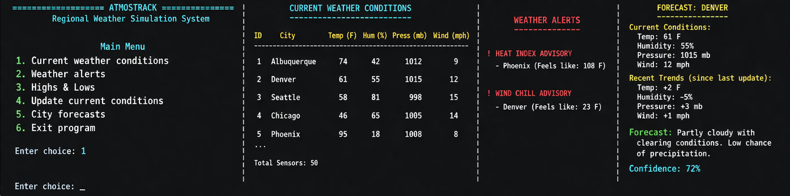
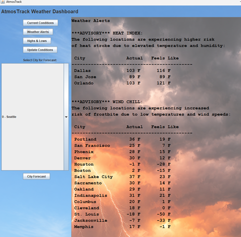

# 🌦️ AtmosTrack

A weather simulation project that evolved from a **terminal-based C program** into a **desktop Java Swing application** with a full graphical user interface.

AtmosTrack began as a systems-focused simulation written in C to model weather sensors, regional conditions, alerts, and forecasts. It was later redesigned in Java with an object-oriented architecture and a Swing-based UI, preserving the core simulation logic while dramatically improving usability, presentation, and portability.

---

## Project Evolution

### Version 1: C Linked-List Simulator
The original AtmosTrack implementation was built in C as a command-line weather simulation engine.

It emphasized:
- Struct-based data modeling
- Circular doubly linked lists with a sentinel node
- Dynamic memory management
- Probabilistic weather updates
- Statistical summaries and forecasting
- Menu-driven terminal interaction

This version served as the systems/programming foundation of the project and focused heavily on low-level design, traversal logic, and state comparison over time.

### Version 2: Java Swing Desktop Application
The project was later rebuilt in Java as a full desktop application.

This version preserved the underlying simulation ideas while introducing:
- Object-oriented design using classes instead of structs
- A complete Swing-based graphical user interface
- Buttons, combo boxes, panels, and layout management
- Background images and visual styling
- Interactive weather displays for conditions, alerts, highs/lows, and forecasts
- Packaging as an executable `.jar`

This redesign shifted AtmosTrack from a console simulation into a user-facing application with a much stronger portfolio presence.

---

## Core Features Across Both Versions

AtmosTrack simulates a network of weather sensors that track:

- Temperature
- Humidity
- Atmospheric pressure
- Wind speed

Both versions retain the essential core systems:

- Sensor generation and initialization
- Probabilistic weather engine
- Regional statistics
- High/low analysis
- Heat index and wind chill alerting
- Rule-based city forecasting

---

## C Version Highlights

### Data Structure Design
The C implementation uses a circular doubly linked list with a sentinel node to store sensor records.

This architecture was chosen to:
- simplify traversal logic
- eliminate many edge-case checks
- demonstrate dynamic memory management in C

### Simulation Pipeline
Each update cycle:
1. copies the previous sensor state
2. updates current weather conditions
3. calculates deltas between states
4. uses those trends in analysis and forecasting

### Systems Concepts Demonstrated
- `malloc` / `free`
- linked list traversal
- deep copying vs mutation
- insertion sort for rankings
- modular procedural design

---

## Java Version Highlights

### Object-Oriented Redesign
The Java version replaces structs and manual list management with classes and Java-side data structures, while preserving the same weather simulation ideas.

### Swing User Interface
The Java application includes:
- a full GUI instead of terminal-only output
- clickable controls
- combo-box-driven interaction
- visual panels for weather data
- integrated backgrounds and styling assets

### Distribution
The Java build is packaged into an executable `.jar`, making it easier to run as a standalone desktop application.

---

## Screenshots

Legacy C terminal example:



New Java UI:




---


## Build Notes

### C Version
Compile with:

```bash
gcc weatherSimLinkWIP.c -o atmos -lm
./atmos
```

### Java Version
Build and package through IntelliJ or your preferred Java build process, ensuring image assets are included in the artifact as resources.
You can also download the pre-packaged JAR file from the release page.

---

## Technical Skills Demonstrated

### C / Systems Programming
- linked lists
- dynamic memory management
- procedural decomposition
- sorting and statistical analysis
- simulation/state tracking

### Java / Desktop Development
- object-oriented redesign
- Swing GUI construction
- event-driven programming
- resource management
- artifact packaging and distribution

---

## Why This Project Matters

AtmosTrack is valuable as a portfolio project because it shows more than one kind of programming skill.

It demonstrates the ability to:
- design a simulation engine from scratch
- work at both low-level and high-level abstraction layers
- refactor ideas across languages and paradigms
- improve usability by evolving a systems project into a GUI application
- think about software as both logic and user experience

---

## Future Improvements

Potential next steps include:
- persistent save/load support
- richer forecast logic
- charts for time-series trends
- configurable sensor counts and region sets
- improved packaging and release workflow
- migration to JavaFX or a web front end
- optional machine-learning-assisted forecast experiments

---

## Author

**Andre DeHerrera**  
Computer Science Major  
University of New Mexico

---

## Notes

This README reflects the project as a two-version evolution:
- the original **C linked-list simulator**
- the newer **Java Swing desktop application**


