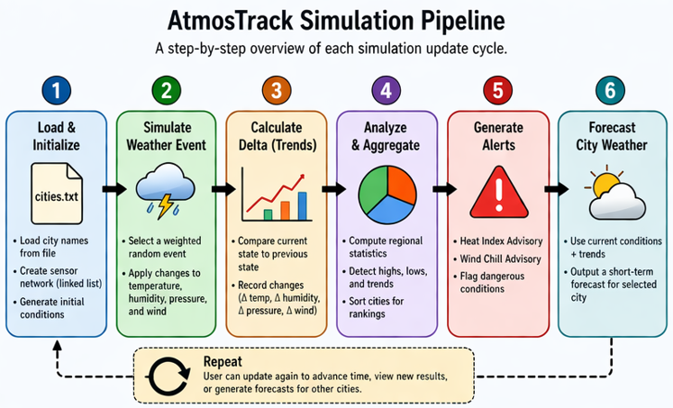

# 🌦️ AtmosTrack
### Linked List Weather Simulation Engine in C
A systems-level weather simulation written in C that models environmental conditions across a network of sensors using a **circular doubly linked list**, probabilistic event modeling, and time-step delta analysis.

---
### Preview


---
## Project Overview
AtmosTrack simulates a distributed network of weather sensors, each tracking:
- Temperature
- Humidity
- Atmospheric Pressure
- Wind Speed

The system evolves over time using a **probabilistic weather engine**, enabling:
- Realistic environmental changes
- Trend detection via delta tracking
- Rule-based forecasting

---
## System Architecture
### 🔗 Linked List Design
AtmosTrack uses a circular doubly linked list with a sentinel node:
```
typedef struct Node {
    Sensor data;
    struct Node *next;
    struct Node *prev;
} Node;

typedef struct {
    Node *header;
    int size;
} SensorList;
```
**Why this matters**
- Eliminates NULL edge cases
- Simplifies traversal and insertion
- Demonstrates real systems-level memory control

---
## Simulation Pipeline
Each update cycle:
1. Copy current state -> previous
2. Apply probabilistic weather event -> current
3. Compute differences -> delta
4. Use delta for forecasting and analytics
```
previous = copyList(&currentList);
updateSensors(&currentList);
calculateDeltas(&previous, &currentList, &delta);
```



---
## Weather Engine (Core Logic)
Weather evolves via weighted random events:
| Event              | Effect             |
| ------------------ | ------------------ |
| Stable             | Minor fluctuations |
| Warming/Drying     | Temp ↑ Humidity ↓  |
| Cooling/Moistening | Temp ↓ Humidity ↑  |
| Falling Pressure   | Storm signals      |
| Rising Pressure    | Clear skies        |
| Humid/Unstable     | Storm potential    |
| Severe Event       | Large swings       |

This creates natural-feeling transitions as opposed to pure randomness.

---
## 📊 Data Analysis & Insights
### Regional Statistics
- Average temperature, humidity, pressure, and wind
- Hottest and coldest cities
- Trend metrics (warming, pressure shifts, change in wind)

### Sorting Algorithms
Insertion sort used to compute:
- Hottest vs coldest cities
- Wettest and driest cities

---
## Weather Alerts
### 🔥Heat Index Advisory
Detects dangerous heat + humidity combinations and issues warnings. Uses NOAA regression formula to compute the perceived elevated temperature.
```
feelsLike = -42.379 + 2.04901523*T + 10.14333127*RH ...
```
### ❄️Wind Chill Advisory
Identifies frostbit-risk conditions and issues warnings. Uses the National Weather Service's formula for calculating the wind chill temperature.
```
feelsLike = 35.74 + 0.6215*T - 35.75*(v^0.16) + ...
```

---
## Forecast Engine
Forecasts combine:
- Current conditions
- Pressure trends
- Humidity levels
- Wind behavior

Example:
```
if (pressure > 1020 && humidity < 40)
    → Clear conditions
else if (humidity > 85 && pressure falling)
    → Thunderstorms likely
```

---
## 🖥️User Interface
```
Main Menu
---------
1. Current weather conditions
2. Weather alerts
3. Highs & Lows
4. Update current conditions
5. City forecasts
6. Exit program
```

---
## Input Data
Imports .txt files that contain city names to use in the data assignment for each sensor struct.
```
cities.txt
```
Example:
```
Albuquerque
Denver
Santa Fe
Los Angeles
Phoenix
...
```

---
## Build & Run
Git repo contains executable file but users can compile and run the source on their own machine using:
```
gcc weatherSimLinkWIP.c -o atmos -lm
./atmos
```
*Note: root folder must contain a cities.txt file for program to compile correctly.

---
## Key Technical Concepts
### Data Structures
- Circular doubly linked lists
- Sentinel node (header) pattern
### Memory Management
- Dynamic allocation (malloc, free)
- Deep copying vs mutation for different functions
### Algorithms
- Insertion sort
- Traversal patterns
### Simulation Design
- Probabilistic modeling
- Constraint clamping
- State-delta comparison

---
## What Makes This Project Stand Out
This is not just a CRUD-style program.

It demonstrates:
- System-level thinking in C
- Dynamic data structures as opposed to just static arrays
- Stateful simulation over time
- Real-world modeling (weather dynamics)
- Separation of concerns (data, logic, UI)

---
## Future Enhancements
- Time-series history tracking
- Multi-region climate simulation
- Graph-based visualization such as plots
- Persistent data logging
- Advanced forecasting using ML integration

---
## 👤 Author

### Andre DeHerrera
Computer Science — University of New Mexico